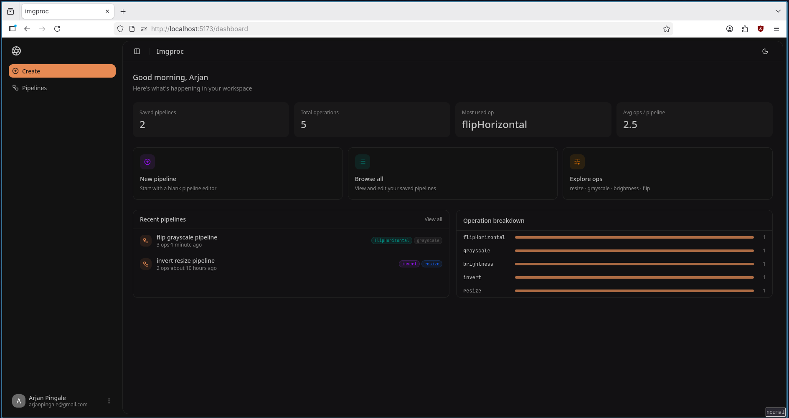
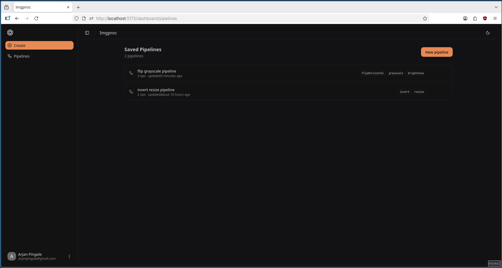
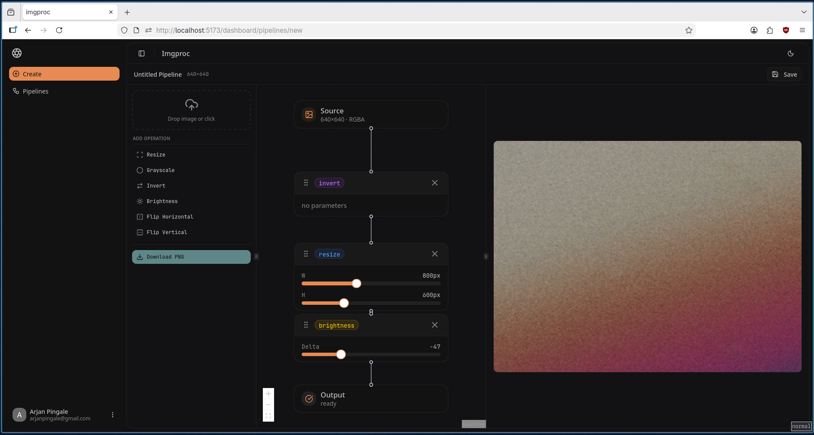

# Imgproc

A high-performance browser-based image processing platform powered by WebAssembly, React Flow pipelines, Fastify APIs, and background workers.

## Features

- WebAssembly image processing core written in C
- Web Workers to run wasm in background thread
- Service worker to handle caching wasm binary and provide some offline support
- Pipeline based image transforms using React Flow

## Tech Stack

### Frontend

- React
- TypeScript
- Vite
- Tailwindcss
- Shadcn
- React Flow
- Web Workers
- Service Workers
- Vite PWA
- Axios
- Tanstack query
- Zustand
- Clerk

### Backend

- Fastify
- PostgreSQL
- Redis
- BullMQ
- Clerk

### Systems / Native

- C
- Emscripten
- stb_image

## Monorepo Structure

```
 packages/
├── api         # Fastify backend API
├── shared      # Shared types/schemas
├── wasm        # WASM TypeScript bridge
├── wasm-core   # Native C image processing core
├── web         # React frontend
└── worker      # Background job workers
```

## Screenshots

### Dashboard



### Pipelines



### Editor



## Getting Started

### Prerequisites

- Nodejs
- pnpm
- Docker
- Emscripten

## Installation

```
git clone https://github.com/Arjan-P/imgproc.git && cd imgproc

# Install appropriate tool versions
asdf install

# install dependencies
pnpm install
```

## Packages Overview

### packages/wasm-core/src/

### Currently implemented in C:

- Brightness
- Grayscale
- Invert Colors
- Horizontal Flip
- Vertical Flip
- Resize

### packages/api

### Responsibilities:

- REST APIs
- Webhook handling
- Auth
- Queue orchestration

### packages/worker

### Handles:

- Background processing
- Queue consumers
- Async tasks
- External integrations

### packages/shared

### Contains:

- Shared types
- API contracts
- Zod schemas
- Pipeline definitions

### packages/web

### Features:

- Pipeline editor
- Dashboard UI
- Offline support
- Service worker caching
- WASM integration
- React Flow graph editor

## Running Developement Environment

### Start infrastructure

```
# from monorepo root
# start db, redis service
docker compose -f infra/docker-compose.yml
```

### Environment Variables

Fill up .env files in packages/{api,worker,web} as mentioned in respective .env.example

### Build dependencies

```
# from monorepo root
pnpm --filter @imgproc/wasm-core build
pnpm --filter @imgproc/wasm build
pnpm --filter @imgproc/shared build
```

### Start processes

```
 # from monorepo root
 pnpm --filter @imgproc/api dev
 pnpm --filter @imgproc/worker dev
 pnpm --filter @imgproc/web dev
```

## Production

```
docker compose -f infra/docker-compose.prod.yml --env-file infra/.env.prod up -d --build
```
